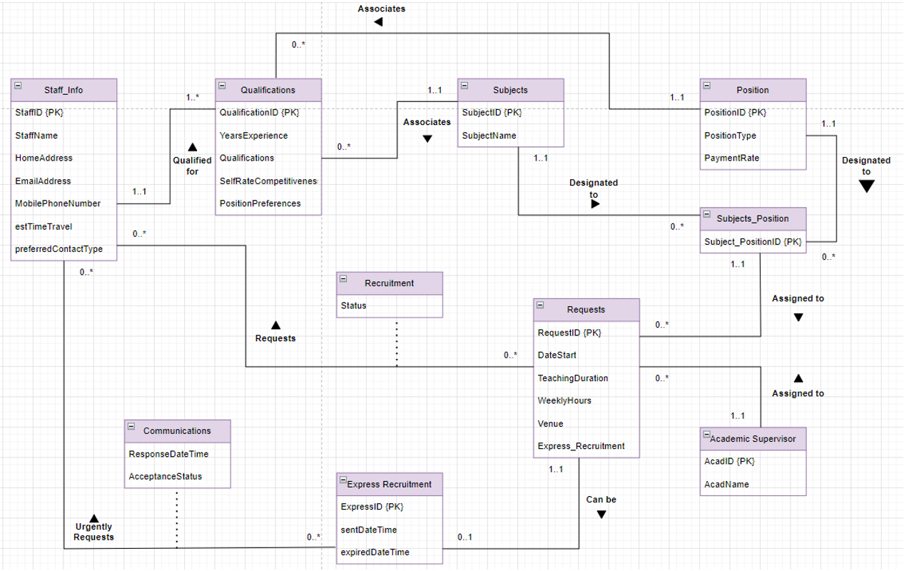
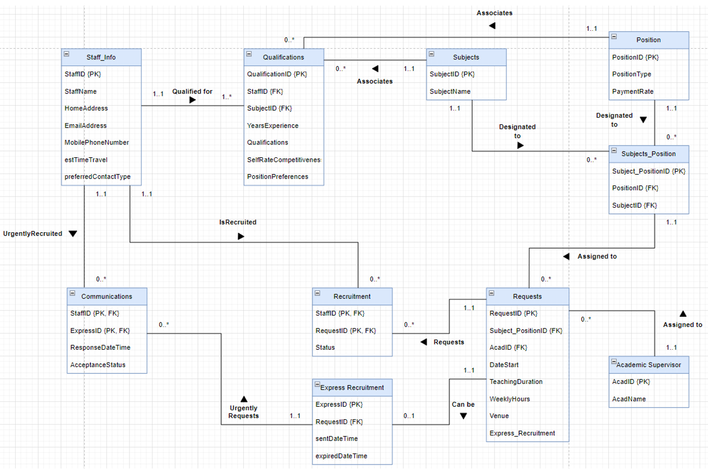
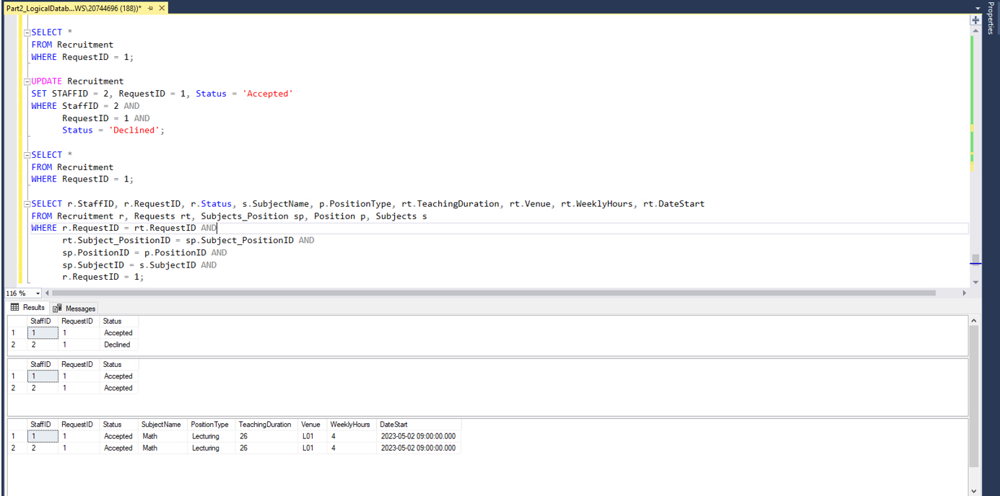

performed by: [Quang Dong Nguyen](https://github.com/Quang2003-SpicyCarrot)  
provided by: Western Sydney University

  

# Key Problem:

## Table of Contents:
- [Analysis Question](#analysis-question)
- [Method](#methods)
- [Review of Results](#quick-review-of-the-results)

## Analysis Question
### Question 1 - Selected additional Exercises
Exercise questions are selective questions extracted from the book "Database system: A practical approach to design, implementation, and management (6th ed)".

### Question 2 - Database Modelling
In this part, you are asked to design a database to support a Instant Recruitment System of casual staff for a
school. The major business requirements are summarised below in the Mini Case: An Instant Recruitment System.
You are asked to develop a detailed Entity-Relationship model for this mini case. Your ER model should consist of a 
detailed ER diagram integrated with itemised discussions on the features of the entities and relationships and all the assumptions you made where applicable. The ER diagram and the accompanying document should identify keys,
constraints, entity types, relationship types, specialisation/generalisation if any, etc. You must use the same notation scheme for the ER diagram as the textbook (use UML notations as shown in the last page of the textbook, and don't use Crew Foot notations), and the ER diagram should be strictly in the way the textbook uses for.  

For this assignment, you may consider making use of the drawing tool https://draw.io, or simply Microsoft
PowerPoint. We note that our past experiences show drawing ER diagrams or relation diagrams on Microsoft
Powerpoint gives one better control and flexibility when compared with drawing diagrams with Microsoft Word.  
1. The ER diagram should include, among others, representative attributes for all entity types, proper subclassing
if any, and correct participation multiplicities for the relationship types. It should be meaningfully and well
designed, and should also include all relevant and necessary aspects, and indicate any supplementary business
rules if you decide to introduce. In any case, supply at least 1 concise business rule that you feel quite
important to your resulting database design. (3 marks)
2. Map the above ER diagram into a global relation diagram (GRD). The GRD should be in a form similar to
Figure 17.9 (page 554, or 516 for edition 5) of the textbook, but all the attributes should be kept there too.
Include in the diagram all the primary keys, foreign keys, and the multiplicity constraints. (2 marks)
3. Please note that an ERD is the artefact of the conceptual database design phase, while a GRD is the artfact of
the logical database design phase which relates to the relational models. As such, a good ERD should be
conceptually more concise and the relationships there should in general remain so rather than becoming extra
entities as in a relational model

## Method:
- Database Design and management
    - Ultilised both Data Manipulation and Data Definition Language to construct the recruitment database for a school and test for the system integrity and effectiveness.
- Data Normalisation, Data Querying, Constraints defining and Business problem-solving with Schema refining skills.
- Database Administration
- Data Analysis 

## Review of Results:  
**Entity-Relational Diagram for the School Recruitment System**  

From the ERD Diagram, we have the following entities:
-	**Staff_Info:** This entity shows the general information of each staff members
-	**Staff_Subjects:** Shows the qualifications, years experience, self-rate competitiveness and preferred Positions for each subjects 
-	**Subjects:** Reviews available Subjects.
-	**Position:** Reviews available position offered by school.
-	**Subjects_Position:** Tells positions for each subject and pay rate based on the position of staff
-	**Requests:** Stores available requests to be sent to staff
-	**Academic Supervisor:** Stores information of available Academic Supervisor
-	**Express_Recruitment:** Stores urgent requests that needs to be reviewed.  
With relationships:
-	*Recruitment:* Tells which staff is assigned to which requests.
-	*Communication:* Tells which staff is assigned to which requests based on the response time of conversation between the staffs and the schools.

  

**Global Relational Diagram for the School Recruitment System**  
  
To improve conceptual design of the database and business rule. I modified some participation multiplicities:
-	Between Staff_Info and Qualifications (1-to-many): Each staff should have at least 1 or many qualifications, since hired staffs should have some basic qualifications before getting hired by the school. And each qualification belongs to only one Casual Staff.
-	Between Subjects – Subjects_Position and Position – Subjects_Position (1-to-many): Each Subjects and position should be designated to at least 1 Subjects_position as every subjects positions have a payment rate. And 
-	Between Staff_Info and Requests (many-to-many relationships): Each casual staff could apply for zero or many requests and each request could be sent to zero or many people. This is the same for between the Staff_Info and Express_Recruitment entities. 

  

**Issues with my Recruitment Database Design**  
In my Recruitment System, there is a flaw in designing the relationship between the Staff_Info table and the Recruitment table. It is mentioned that between them there is a many-to-many cardinality relationship, which means a staff can be offered by multiple requests and a request can be sent to multiple staffs. This, however, created a difficult problem in the system to sort who will be assigned to which jobs on which days. Since in my recruitment system, date and times are specified clearly and they are fixed terms, meaning they are constant throughout the term. And because of that, some requests sent to Staffs will have similar days and time, so it tells that many staffs will be offered for the same requests and at the same time. This problem causes a major disruption in data input in. Every result inputted in this table must be manually checked before any value is inserted.  For example, in the table Recruitment, Request #1 and #2 is sent to both Staff #1 and Staff #2. Staff #1 is accepted while Staff #2 declined because I have decided so when I created the table. However, in the real-world scenario, both Staffs could have accepted. This would cause conflicts in the final timetable as both staffs will be on the same time, at the same venue and same position. Hence, the database manager eventually would have manually decided who to take on that job for a casual position. That is the situation where I am at. Adding primary keys, foreign keys or even trying different SQL input would not resolve the case completely.
Using SQL as an example:
 

As shown in the figure above, before the update, there are 2 requests being sent to staff #1 and #2, one Staff declined and the other accepted. However, after the update of values to represent the actual representation of data in the real world, there are two staffs that are accepted to be the lecturer of Math for the next semester. This data does not accurately depict the real situation where two people should not be teaching at the same time. Hence, this database design is not enough to ensure all the data integrity within the business context.

  

## Reference to essential reading materials:
Connolly, T. M., & Begg, C. E. (2014). Database systems: A practical approach to design, implementation,
and management (6th ed.). Boston, MA: Pears.
